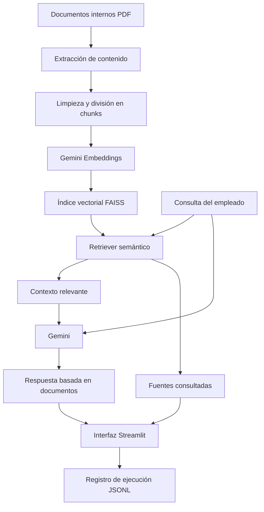
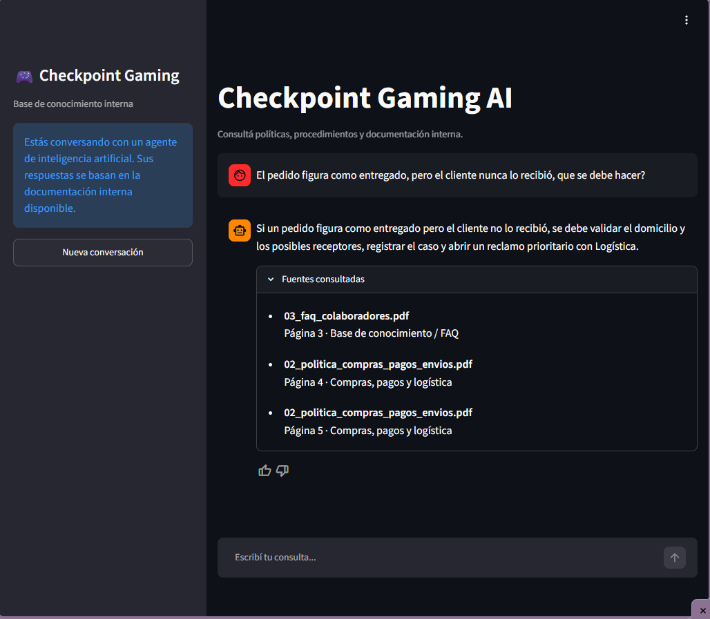

# 🎮 Checkpoint Gaming AI

Checkpoint Gaming AI es un agente de inteligencia artificial desarrollado como proyecto para el **Challenge de Alura**, orientado a facilitar la consulta de documentación interna dentro de una empresa ficticia de e-commerce especializada en productos gaming.

El sistema permite que los colaboradores realicen preguntas en lenguaje natural sobre políticas, procedimientos y situaciones frecuentes de la empresa, obteniendo respuestas basadas en la documentación interna disponible.

El proyecto utiliza una arquitectura **RAG (Retrieval-Augmented Generation)** para recuperar información relevante desde documentos corporativos y generar respuestas contextualizadas, reduciendo el riesgo de respuestas inventadas o fuera del alcance de la base de conocimiento.

---

## Objetivo del proyecto

El objetivo de Checkpoint Gaming AI es centralizar el acceso a información interna y permitir que los empleados puedan consultar rápidamente procedimientos relacionados con:

- Atención al cliente y postventa.
- Cambios y devoluciones.
- Garantías.
- Compras y pagos.
- Envíos y logística.
- Reintegros.
- Preguntas frecuentes de colaboradores.

En lugar de buscar manualmente información dentro de distintos documentos, el usuario puede realizar una consulta directamente al agente y obtener una respuesta acompañada por las fuentes consultadas.

---

## ¿Cómo funciona?

Checkpoint Gaming AI utiliza una arquitectura **RAG (Retrieval-Augmented Generation)**.

Los documentos internos son procesados, divididos en fragmentos y convertidos en embeddings que se almacenan en un índice vectorial FAISS.

Cuando un empleado realiza una consulta, el sistema recupera los fragmentos más relevantes y los utiliza como contexto para que Gemini genere una respuesta basada en la documentación disponible.

La respuesta se presenta junto con las fuentes consultadas y cada ejecución queda registrada para mantener trazabilidad.

---

## Arquitectura



---

## Tecnologías utilizadas

### Inteligencia artificial y RAG

- Python
- LangChain
- Google Gemini
- Gemini Embeddings
- FAISS
- PyPDF

### Interfaz

- Streamlit

### Infraestructura y despliegue

- Oracle Cloud Infrastructure (OCI)
- OCI Compute
- Ubuntu
- systemd

### Control de versiones

- Git
- GitHub

---

## Base de conocimiento

La base de conocimiento del agente está compuesta por documentación interna ficticia creada para Checkpoint Gaming.

Actualmente contiene:

### `01_manual_atencion_postventa.pdf`

Incluye información relacionada con:

- Atención postventa.
- Cambios.
- Devoluciones.
- Garantías.
- Productos dañados.
- Reclamos.
- Escalamiento de casos.

### `02_politica_compras_pagos_envios.pdf`

Incluye procedimientos relacionados con:

- Compras.
- Medios de pago.
- Facturación.
- Preparación de pedidos.
- Envíos.
- Seguimiento.
- Logística.
- Cancelaciones.
- Reintegros.

### `03_faq_colaboradores.pdf`

Contiene preguntas frecuentes destinadas a colaboradores sobre:

- Garantías.
- Envíos.
- Devoluciones.
- Compatibilidad de productos.
- Seguridad.
- Procedimientos internos.
- Escalamiento de casos.

---

## Recuperación de información

Los documentos son procesados y divididos en fragmentos de texto utilizando `RecursiveCharacterTextSplitter`.

Cada fragmento conserva metadatos asociados, como:

- Documento de origen.
- Página.
- Categoría.
- Área responsable.

Los fragmentos son convertidos en embeddings y almacenados en un índice vectorial FAISS.

Cuando el usuario realiza una consulta, el sistema:

1. Genera el embedding de la pregunta.
2. Busca los fragmentos semánticamente más similares.
3. Aplica un umbral mínimo de relevancia.
4. Recupera los fragmentos relacionados.
5. Construye el contexto que será enviado al modelo.

Este proceso permite priorizar información relevante antes de generar cada respuesta.

---

## Generación de respuestas

El agente utiliza Gemini para generar respuestas a partir del contexto recuperado desde la documentación interna.

El sistema fue diseñado para:

- Responder utilizando la información recuperada de la base documental.
- Evitar inventar políticas o procedimientos inexistentes.
- Mostrar las fuentes documentales consultadas.
- Mantener contexto en preguntas de seguimiento.
- Detectar consultas fuera del alcance de la documentación.

Cuando no encuentra información suficiente, responde:

> No encontré esta información en los documentos disponibles de Checkpoint Gaming.

De esta manera, el agente evita generar respuestas que no estén respaldadas por la base de conocimiento disponible.

---

## Ejemplos de consultas

El agente está pensado para ser utilizado por empleados de la organización.

Algunas consultas posibles son:

### Producto dañado

> Un cliente informa que recibió un producto dañado. ¿Qué procedimiento debo seguir?

El agente recupera información del manual de atención y postventa para indicar el procedimiento correspondiente.

---

### Pedido entregado pero no recibido

> Un cliente dice que su pedido figura como entregado, pero no lo recibió. ¿Cómo debo gestionar el caso?

Respuesta obtenida durante las pruebas:

> Si un pedido figura como entregado pero el cliente no lo recibió, se debe validar el domicilio y los posibles receptores, registrar el caso y abrir un reclamo prioritario con Logística.

El sistema también muestra los documentos y páginas consultados para generar la respuesta.

---

### Garantía

> Un cliente compró un joystick y dejó de funcionar. ¿Cómo debo gestionar la garantía?

El agente consulta la documentación de postventa y garantías antes de generar la respuesta.

---

### Devolución de productos

> Un cliente quiere devolver unos auriculares in-ear que ya fueron abiertos porque cambió de opinión. ¿Corresponde aceptar la devolución?

El agente analiza las políticas de devolución disponibles antes de responder.

---

## Interfaz

La aplicación utiliza Streamlit como interfaz web.

La interfaz permite:

- Realizar consultas mediante un chat.
- Mantener el historial de conversación.
- Realizar preguntas de seguimiento.
- Consultar las fuentes recuperadas.
- Identificar documento, página y categoría de cada fuente.
- Iniciar una nueva conversación.
- Enviar feedback mediante 👍 o 👎.
- Informar claramente que el usuario está interactuando con un sistema de inteligencia artificial.

---

## Registro de ejecuciones

El proyecto implementa un sistema de registro de ejecuciones para mantener la trazabilidad del agente.

Cada consulta realizada genera una entrada en:

```text
logs/executions.jsonl
```

Cada registro contiene:

- Fecha y hora en UTC.
- Identificador anónimo de sesión.
- Pregunta realizada.
- Respuesta generada.
- Fuentes recuperadas.
- Tiempo de respuesta.

Ejemplo conceptual:

```json
{
  "timestamp": "2026-07-21T00:00:00+00:00",
  "session_id": "identificador-de-sesion",
  "question": "Un cliente informa que recibió un producto dañado. ¿Qué procedimiento debo seguir?",
  "answer": "Respuesta generada por el agente...",
  "sources": [],
  "response_time_ms": 1200
}
```

Los registros reales se generan durante la ejecución de la aplicación y no se almacenan en el repositorio público.

La carpeta `logs/` se encuentra incluida en `.gitignore`.

---

## Estructura del proyecto

```text
checkpoint-gaming-agent/
│
├── data/
│   ├── 01_manual_atencion_postventa.pdf
│   ├── 02_politica_compras_pagos_envios.pdf
│   └── 03_faq_colaboradores.pdf
│
├── docs/
│   └── evidencias/
│       ├── ejecucion_oci.png
│       └── demo_checkpoint_gaming_ai.mp4
│
├── src/
│   ├── app.py
│   ├── document_loader.py
│   ├── execution_logger.py
│   ├── indexer.py
│   ├── rag.py
│   └── retriever.py
│
├── vector_store/
│   ├── checkpoint.index
│   └── chunks.json
│
├── .env.example
├── .gitignore
├── README.md
└── requirements.txt
```

---

## Instalación y ejecución local

### 1. Clonar el repositorio

```bash
git clone https://github.com/cristinaboada19/checkpoint-gaming-agent.git
cd checkpoint-gaming-agent
```

---

### 2. Crear un entorno virtual

```bash
python -m venv .venv
```

En Windows PowerShell:

```powershell
.\.venv\Scripts\Activate.ps1
```

En Linux o macOS:

```bash
source .venv/bin/activate
```

---

### 3. Instalar las dependencias

```bash
pip install -r requirements.txt
```

---

### 4. Configurar la API Key

Crear un archivo `.env` en la raíz del proyecto utilizando `.env.example` como referencia.

```text
GOOGLE_API_KEY=tu_api_key
```

El archivo `.env` se encuentra excluido del repositorio mediante `.gitignore`.

---

### 5. Generar el índice vectorial

```bash
python src/indexer.py
```

Este proceso:

- Lee los documentos de `data/`.
- Extrae el contenido.
- Divide los textos en fragmentos.
- Genera embeddings.
- Construye el índice FAISS.
- Guarda el índice dentro de `vector_store/`.

---

### 6. Ejecutar la aplicación

```bash
streamlit run src/app.py
```

Streamlit mostrará la dirección local desde la cual se puede acceder a la aplicación.

---

## Actualización de la base de conocimiento

Cuando se agregan o modifican documentos internos:

1. Actualizar los archivos correspondientes dentro de:

```text
data/
```

2. Revisar los metadatos definidos para los documentos.

3. Regenerar el índice:

```bash
python src/indexer.py
```

4. Reiniciar la aplicación.

De esta manera, el agente utilizará la nueva versión de la documentación.

---

## Despliegue en Oracle Cloud Infrastructure

Checkpoint Gaming AI se encuentra desplegado en **Oracle Cloud Infrastructure (OCI)** utilizando una instancia de Compute con Ubuntu.

La arquitectura de despliegue incluye:

```text
Internet
   ↓
OCI Virtual Cloud Network
   ↓
Public Subnet
   ↓
OCI Compute Instance
   ↓
Ubuntu
   ↓
Streamlit + RAG
   ↓
Checkpoint Gaming AI
```

La aplicación se ejecuta como un servicio de `systemd`, permitiendo que el agente continúe funcionando incluso después de cerrar la conexión SSH.

El servicio mantiene la aplicación disponible de forma independiente de la sesión utilizada para administrar la instancia.

---

## Demo y evidencias de funcionamiento

La aplicación fue desplegada públicamente en Oracle Cloud Infrastructure.

**Demo:**

```text
http://129.151.38.149:8501
```

> La disponibilidad de la demo depende del estado de la instancia de OCI y de los servicios externos utilizados por el proyecto.

### Ejecución del agente en OCI

La siguiente captura muestra una consulta realizada al agente desplegado en Oracle Cloud Infrastructure, incluyendo la respuesta generada y las fuentes documentales recuperadas.



### Video demostrativo

Se realizó una demostración del agente utilizando diferentes consultas internas relacionadas con procedimientos de la organización.

Durante la ejecución se puede observar:

- Interacción mediante lenguaje natural.
- Recuperación de documentación interna.
- Generación de respuestas contextualizadas.
- Visualización de las fuentes consultadas.
- Manejo de diferentes tipos de consultas.

[Ver video demostrativo](docs/evidencias/demo_checkpoint_gaming_ai.mp4)

---

## Pruebas y validación

Durante el desarrollo se realizaron pruebas sobre distintos escenarios para validar el comportamiento del agente y la calidad de las respuestas recuperadas desde la documentación interna.

Se verificaron casos relacionados con:

- Atención al cliente y postventa.
- Productos dañados.
- Garantías.
- Cambios y devoluciones.
- Compras, pagos y reintegros.
- Envíos y situaciones logísticas.
- Preguntas de seguimiento dentro de una conversación.
- Consultas sin información disponible en la base de conocimiento.

También se realizaron pruebas con preguntas completamente ajenas a la documentación interna para comprobar que el agente no utilizara conocimiento externo ni generara respuestas sin respaldo documental.

Por ejemplo, ante la consulta:

> ¿Quién es Messi?

El agente respondió:

> No encontré esta información en los documentos disponibles de Checkpoint Gaming.

De esta manera, se verificó que el agente mantuviera sus respuestas dentro del alcance de la base de conocimiento disponible.

Finalmente, el sistema fue probado luego de su despliegue en Oracle Cloud Infrastructure, verificando el funcionamiento de la interfaz, la recuperación de información, la generación de respuestas, la visualización de fuentes y el registro de ejecuciones.

---

## Funcionalidades implementadas

- Procesamiento de documentos PDF.
- Limpieza y división del contenido.
- Generación de embeddings.
- Indexación vectorial con FAISS.
- Recuperación semántica.
- Arquitectura RAG.
- Generación de respuestas con Gemini.
- Control de consultas fuera de contexto.
- Visualización de fuentes documentales.
- Historial conversacional.
- Manejo de preguntas de seguimiento.
- Interfaz web con Streamlit.
- Sistema de feedback.
- Registro de ejecuciones.
- Despliegue en Oracle Cloud Infrastructure.
- Ejecución persistente mediante systemd.

---

## Autora

**Cristina Boada**

Proyecto desarrollado para el Challenge de Alura.